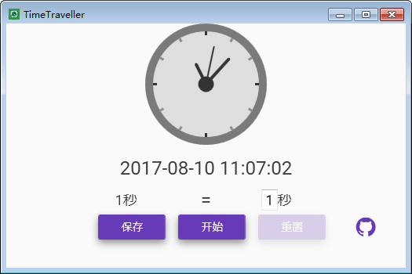
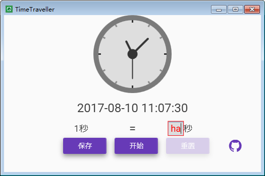
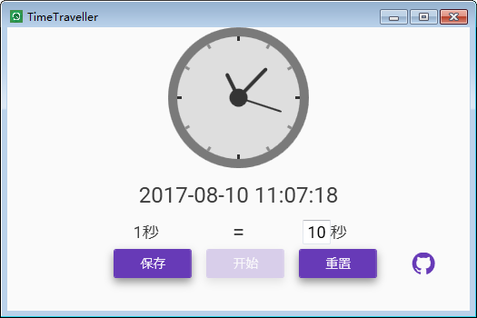

# TimeTraveller

## OverView
作为打酱油的Windows桌面程序开发者，在程序中经常会使用到`Timer`。因此测试程序时难免要等待几分钟甚至数小时。在开发阶段可以使用`#DEBUG`条件编译避免等待过长的时间。但程序早晚是要在模拟真实环境测试的，一方面怕调试代码和最终发布代码混乱，另一方面并不是所有的操作都会记录Log信息，又不愿意等过长时间。因此这个让时间变快的小程序诞生了,其实叫`TimeFaster`更合适。

## Summary
此程序使用WPF结合MVVM模式开发。

此程序的功能：

1. 设置1秒转换的倍数；
2. 验证数据输入；
3. 开始，自动加快系统时间；
4. 重置，将系统还原为北京时间，需要网络；
5. 保存当前设置。

## Screenshots

